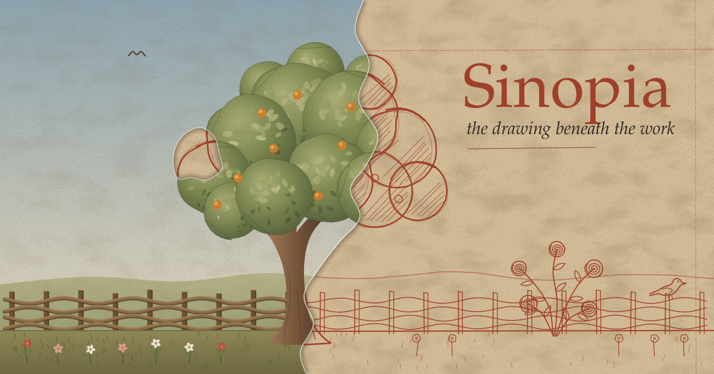

# Sinopia

*The drawing beneath the work.*



Sinopia is a whiteboard for [Omarchy](https://omarchy.org). You draw what you mean, a screen, a flow, a diagram, a rough idea, and hand it to the coding agent working in the terminal next to it. The agent builds from the drawing instead of from a paragraph trying to describe it.

It is named after the red underdrawings Italian fresco painters brushed onto the wall before any paint went on. Nobody was meant to see them, yet they decided where every figure would stand. [The story of the name](docs/sinopia/README.md) is worth the read.

## Why draw

Some ideas are easier to draw than to write. Where a button goes, how three screens connect, which part of a diagram is wrong: a sketch says it in seconds, and a prompt takes paragraphs and still leaves the agent guessing.

Sinopia keeps that sketch close to the work. It opens on a shortcut beside your terminals, wears the desktop's theme, and knows which agents are running on the machine. When the drawing is ready, one key sends it.

## What you can do

**Draw.** An infinite board with a pencil that follows your hand and a shelf of brushes of its own. Bring in the brush sets you downloaded for Sketchbook with `sinopia brushes import`, nibs and papers included. A pen tablet's pressure and tilt shape the line. Boxes, ellipses, triangles, stars, lines and arrows come from one shape tool, and words from a text tool, each set from a bar of its own. Paste screenshots and images straight onto the board.

**Arrange.** Layers and groups, as in any drawing app, with blend modes, opacity, locks and colour tags. Frames mark out an area of the board and give it a name. Several boards live in tabs, and undo walks back through every change.

**Send it to an agent.** Select something or pick a frame, press `Ctrl+E`, choose an agent running in tmux or herdr, and add a line of instruction. The drawing lands in that agent's project as a picture, its structure and a short written inventory, and your instruction arrives in the agent's prompt. Claude Code, Codex, OpenCode, Gemini CLI and Crush are recognised, and their skills can be called from the same box.

**Let the agent draw back.** With the bundled skill installed, an agent can list the frames on your board, read one, and add a new frame of its own beside yours. When you ask, it can also label and annotate the board and arrange its layers. Every change it makes is one step you can undo, and it never switches your tabs. The board stays yours.

## What it keeps to

- **Local.** Boards are files on your disk, readable only by you. Nothing goes over the network.
- **Yours.** An agent reads the drawing as a description of what you drew, never as an order, and whatever it changes you can undo.
- **At home on Omarchy.** The board follows the desktop's colours, font and corners, and changes with them when you switch themes. The ink you draw with does not: a colour picked today stays the same tomorrow.

## Install

On Arch and Omarchy, from the AUR:

```sh
yay -S sinopia-bin   # the latest release, ready made
yay -S sinopia       # the latest release, built from source
yay -S sinopia-git   # the latest commit, built from source
```

Then open it from the app launcher, or from a terminal:

```sh
sinopia          # the most recent board
sinopia --new    # a new one
```

Three extras come with the package, switched off, and the install message says how to turn each one on:

- a bar widget for the Omarchy shell, to open a new board or a recent one;
- a theme hook, so a board left open follows a theme change right away;
- the skill that lets the agents on the machine read your frames and add new ones.

Anywhere else, the archive on the [releases page](https://github.com/edumoraes/sinopia/releases) holds the binary and lays itself out with `sudo sh packaging/install.sh sinopia /` from inside it. To build from source: `cargo build --release` (Rust, on Wayland with Vulkan).

## An earlier name

Sinopia was built under a working name, Omawhite. Boards kept under that name come along the first time Sinopia starts, and `.omawhite` files still open.

## More

- [The story behind the name](docs/sinopia/README.md): Pisa, the fire of 1944, and a workshop method five centuries old.
- [DEVELOPMENT.md](DEVELOPMENT.md): what exists today, every key and control, and how the code is laid out.
- [ARCHITECTURE.md](ARCHITECTURE.md): the working draft of the design.
- [PACKAGING.md](PACKAGING.md): how a release reaches people.
- [skills/sinopia](skills/sinopia/SKILL.md): the skill an agent uses to read and add frames.

## License

MIT. What Sinopia embeds that belongs to others, a font and the agents' marks, is listed in [THIRD-PARTY.md](THIRD-PARTY.md).
