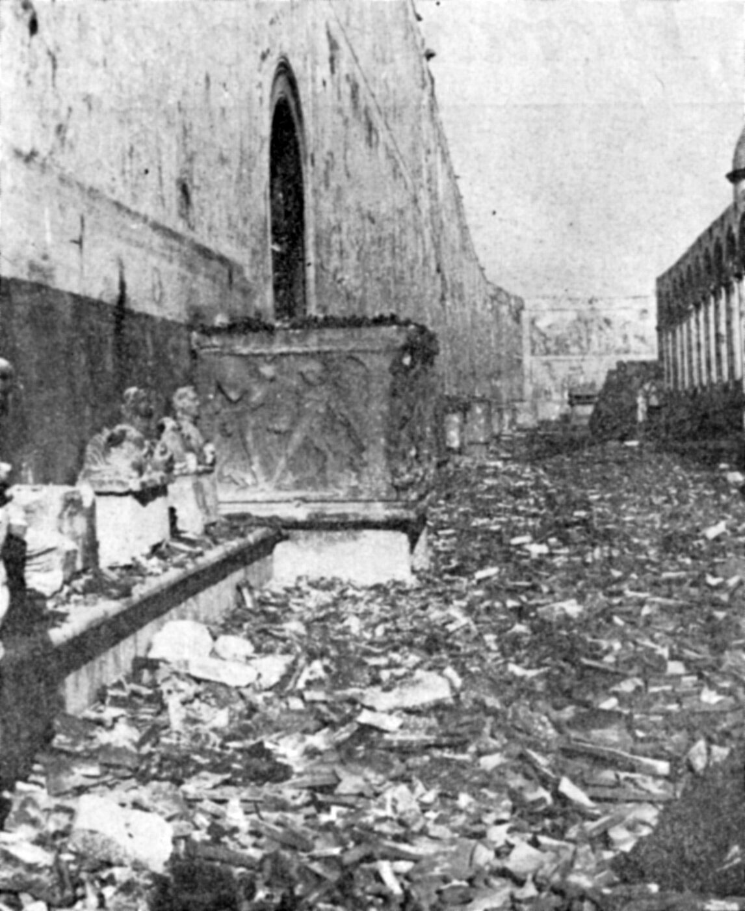
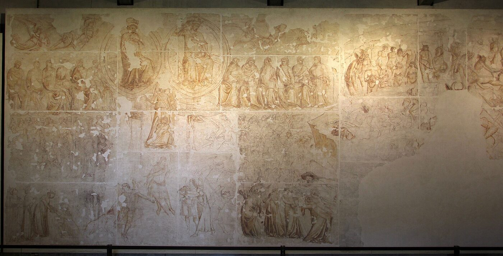
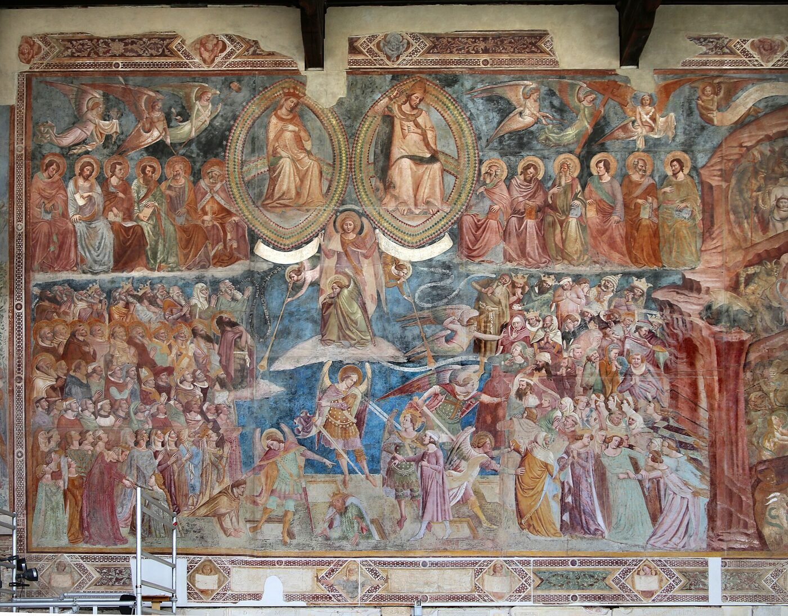
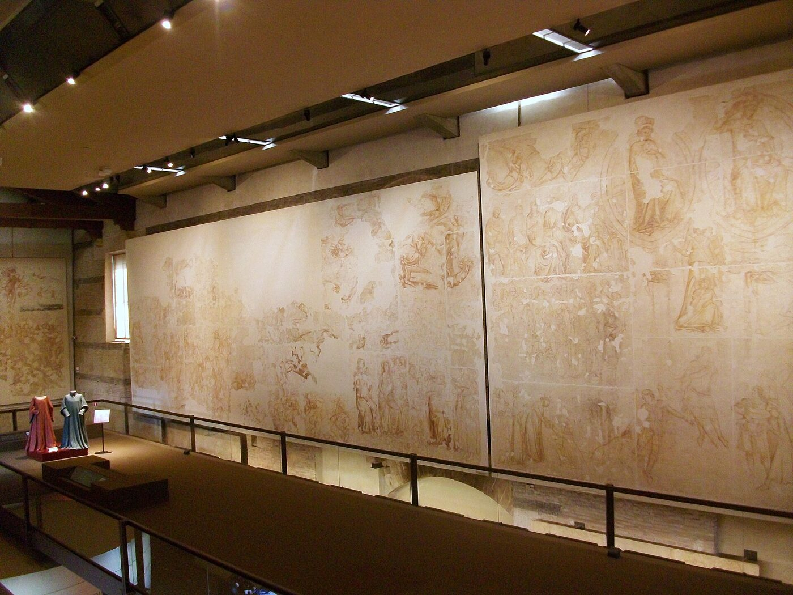
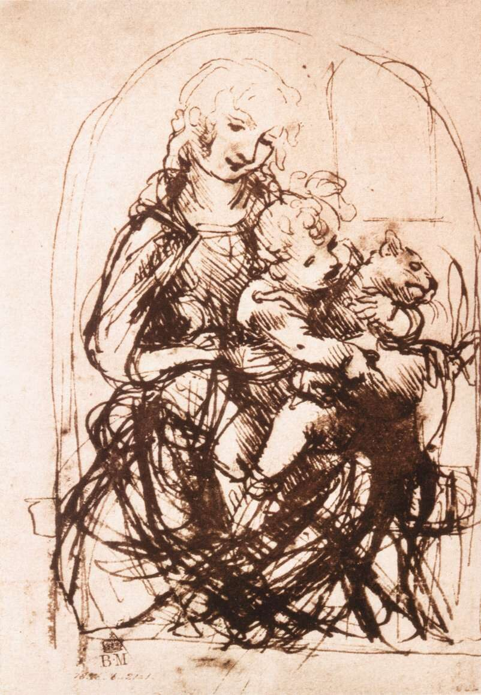
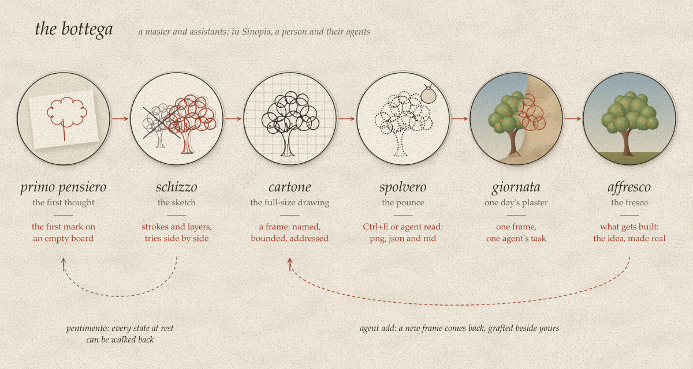
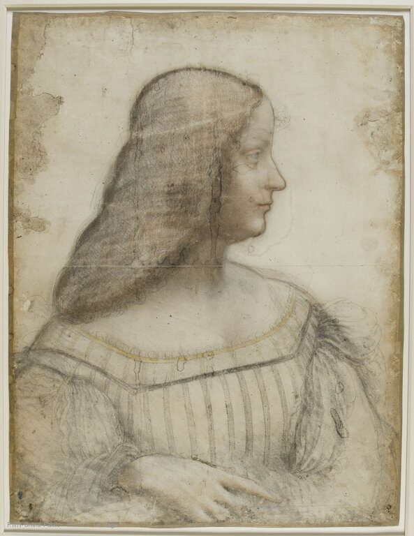
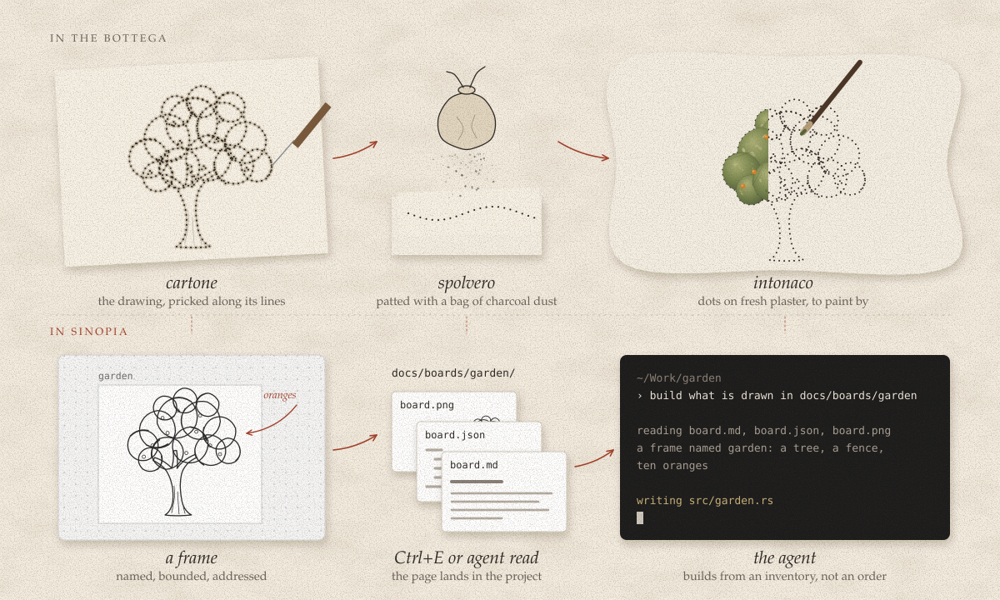
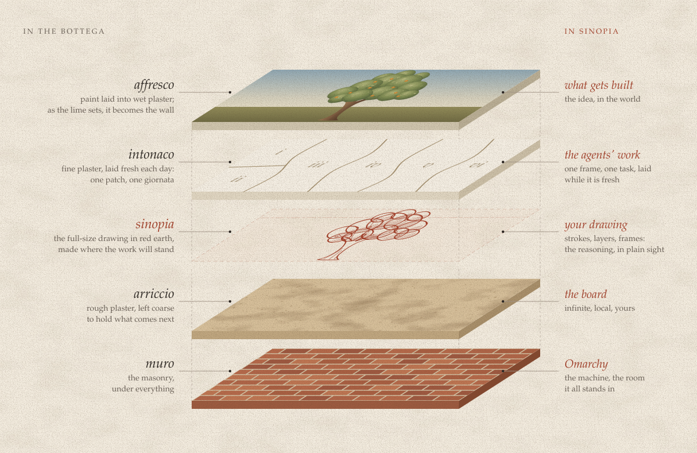

# Sinopia

*The drawing beneath the work.*

> *El fondamento dell'arte, e di tutti questi lavorii di mano principio, è il disegno e 'l colorire.*
>
> The foundation of the art, and the beginning of all this handiwork, is drawing and colouring.
>
> Cennino Cennini, *Il libro dell'arte*, c. 1400

## A wall in Pisa

On 27 July 1944 an Allied artillery shell set fire to the roof of the Camposanto, the monumental cemetery beside the cathedral in Pisa. The roof was timber sheathed in lead, and it burned for three days. The lead melted and ran down walls that had been painted since the fourteenth century. The heat blistered the plaster and turned the colours red.

*The Camposanto after the fire of 1944. Photo: Opera della Primaziale Pisana.*

In 1947 restorers began lifting what was left of the paint off the walls, and underneath it they found drawings: wall after wall of them, full size, brushed in a rust-red earth onto the rough plaster the paintings had been laid over. Before any colour went on, the painters had drawn the figures where they would stand. Then they covered the drawing a patch at a time with the fresh plaster they painted into, and nobody saw it again for centuries.

*Buonamico Buffalmacco, Last Judgment, Camposanto, 1336-41: the sinopia (above) and the fresco that covered it. Photos: Sailko, CC BY 3.0.*

These drawings are called *sinopie*. Pisa gave them a museum of their own, the Museo delle Sinopie, which opened in 1979 on the same square as the Leaning Tower. They can look more alive than the frescoes that hid them. The paint is careful, while the red lines are fast and keep the painters' changes of mind: an arm moved, a head tried twice, a figure that wandered off and was pulled back. Looking at a sinopia, you watch someone think.

*The Museo delle Sinopie, Pisa. Photo: Joanbanjo, CC BY-SA 3.0.*

This app is named after them.

## Disegno

Renaissance Italian had one word for what those red lines are. *Disegno* is drawing, the line on the wall, and it is also design, the intention the line comes from. The word goes back to Latin *designare*, to mark out, with *segno*, the mark, at its centre. English *design* still holds both senses. Portuguese keeps them in two words from the same Latin root: *desenho*, the drawing, and *desígnio*, the purpose.

Giorgio Vasari wrote the lives of the artists, and in 1563 he helped found the Accademia delle Arti del Disegno in Florence, usually counted as the first official academy of art in Europe. In the second edition of his *Lives* he called disegno the father of the three arts, architecture, sculpture and painting, and defined it like this:

> *… una apparente espressione e dichiarazione del concetto che si ha nell'animo …*
>
> … a visible expression and declaration of the concept one holds in the mind …
>
> Giorgio Vasari, *Le vite*, 1568

Forty years later, in Turin, the painter Federico Zuccari split the word in two. The *disegno interno*, in his words "the concept formed in our mind", is the idea before any line is drawn. It is complete for the person who has it and invisible to everyone else. The *disegno esterno* is the same idea brought out onto paper, canvas or a wall, where somebody else can see it, argue with it and build on it. Zuccari liked the word enough to play with it: *di-segn-o*, he wrote, is a *vero segno di Dio in noi*, a true sign of God in us.

Sinopia works on the line between the two. An idea nobody has drawn exists for one person. Once it is drawn, other people can see it and argue with it, and now it can also be handed to an agent that builds it.

## The garden

The idea behind Sinopia is that a computer is a garden of ideas, a place you cultivate. Given enough attention, you can grow something there that is beautiful to you and to other people.

The word *culture* started in a field. Latin *colere* meant to till the ground, and also to tend, to live in and to honour, and *cultura* was the tilling. Cicero lent the farmer's word to the mind (*cultura autem animi philosophia est*, philosophy is the cultivation of the soul), and the modern sense of *culture* grew out of that metaphor.

A garden is ground that someone has paid attention to. Nothing in it arrives finished: it is sown, watered, pruned and grafted, and then it grows. The Latin for pruning, *putare*, also meant to reckon and to think, and *computare* is built on it. In the second century Aulus Gellius explained the verb this way. To *putare* was to cut away what was useless and keep what seemed sound, and the word was used of trees, of vines and of accounts. Thinking was the same cut made in one's opinions: lop off the false ones and keep what seems true. Deciding what stays is a kind of thinking.

Leonardo da Vinci described the first stage of a picture in words that belong in a garden. He told the painter composing a scene not to give the limbs of the figures finished outlines. Block them in roughly, he said, and attend first to the movement, the way poets write their verses, cross some out and write them better. He also told painters to look at walls smeared with stains and find landscapes in them, and battles, and figures in motion, because in confused things the mind wakes to new inventions. He called a rough first draft of that kind a *componimento inculto*, an uncultivated composition. If it suits what was invented, he wrote, it will please all the more once it is adorned with the perfection proper to all its parts.

*Leonardo da Vinci, study for the Virgin and Child with a cat. The pose is found by drawing over it again and again. Public domain.*

Every picture starts *inculto*. So does every garden, and every program. The work is to cultivate it.

## A room made by hand

Omarchy's name joins *omakase* to Arch, the Linux it is built on. *Omakase* means "I'll leave it up to you", the meal where the chef chooses every course, and the project says what it takes from the word: "we pick the tools and tune the details, so you can get straight to work. But this is your computer. You're free to change everything." It is a desktop with an opinion, put together by someone who cared how each piece looks and how it feels to use.

Sinopia is meant to live in that room. It opens on a shortcut next to the terminals where the agents run, and it wears whatever theme the desktop is wearing, read from the same files every other app on the desktop reads. What it adds is the thing the room lacked, a wall to draw on before anything gets built.

## The bottega

A Renaissance fresco was rarely the work of one pair of hands. It came out of a *bottega*, a workshop where a master and assistants shared the work, and it passed through a sequence of drawings, each one a step closer to the wall.

The *primo pensiero*, the first thought, is a few lines on a scrap of paper: the whole picture as a gesture, before anyone knows whether it works.

The *schizzo*, the sketch, is that first thought worked over, tried again, crossed out and tried again beside itself, until the shape turns up.

The *cartone*, the cartoon, is a drawing at the full size of the painting, clean enough to transfer. English got the word *cartoon* from it.

*Leonardo da Vinci, cartoon for a portrait of Isabella d'Este, Louvre. The outlines are pricked for transfer. Public domain.*

The *spolvero* is the pounce. The painter pricked the cartoon's lines with a needle, held the sheet against the wet plaster and patted it with a small bag of charcoal dust. The dust went through the holes and left the drawing on the wall as a line of dots, for the assistants to paint by.

The *giornata* is a day's work. Fresco is painted into wet plaster, so only as much fresh plaster was laid as could be painted before it set, and a wall went up one patch a day.

The *affresco* is the fresco itself, the painting in the wall and part of it.

Some of the earlier work always shows through. Painters call those traces *pentimenti*, repentances: the places where someone changed their mind, and the wall kept the record.

Sinopia takes the shape of that workshop and not its parts. The idea is simple: the thinking happens in the drawing, before anything is built, and the people and agents who build work from that drawing instead of from a guess.

## Anatomy of a wall

A fresco is built in layers, and the layers explain the method. The *arriccio*, a rough plaster of lime and sand, goes on the masonry and is left coarse. The sinopia is drawn on the arriccio. Over the sinopia, one day at a time, goes the *intonaco*, a fine plaster laid wet and painted while wet. The paint binds into it as the lime sets and becomes part of the wall.

The drawing sits in the middle of that stack. It comes after the ground is ready and before any of the finished work, and the finished work covers it. Nobody sees the sinopia once the wall is done, yet the figures on the wall still stand where the red line put them, give or take a change of mind. That is the place the app wants to hold: under the work, and ahead of it.

## What the name asks of the app

A name makes promises. These are the ones this name makes.

Drawing comes first, since disegno is the father of the arts. Sinopia is a place to draw before it is anything else, and the part that talks to agents is there to serve the drawing.

Rough work is welcome. A *componimento inculto* needs room, and nothing should ask you to tidy up before you are ready.

The drawing stays yours. In a bottega the master drew the sinopia and the assistants painted from it. Agents can read the drawing and bring work back to it, but they do not take it over.

The drawing informs and the person decides. What an agent reads is a picture of what was drawn, never an order, and which parts get built is up to you.

The wall is local. A fresco lives in the wall it was painted on, and a board lives on your disk.

## The name

*Sinopia* comes from Sinope, now Sinop, a port on the Turkish coast of the Black Sea. Merchants brought a red earth down to it from the caves of Cappadocia and shipped it on, and the earth took the port's name. Strabo called it the best in the world. Pliny the Elder explains the name: *Sinopis inventa primum in Ponto est; inde nomen a Sinope urbe*, sinopis was first found in Pontus, and hence its name, from the city of Sinope.

Italian painters kept the word for the red and drew with it. Cennini tells the fresco painter to take a little sinopia, unbound, and trace noses, eyes, hair and the outlines of the figures with a fine pointed brush. The drawings themselves took the pigment's name only after the Second World War, when the great campaigns of detaching frescoes brought them to light, and *sinopia* came to mean the drawing under a fresco.

In Italian it is said *si-NÒ-pia*.

It is a quiet name for a drawing nobody was meant to see, which shaped what everybody sees.

## Coda

Nobody in Pisa went looking for the sinopie. The fire found them. For centuries they had been under the paint, where nobody could see them, and nearly every figure above them stood where they had said it would.

## Sources

- Cennino Cennini, *Il libro dell'arte* (c. 1400), ed. Gaetano and Carlo Milanesi (Florence: Le Monnier, 1859): ch. IV, p. 4, the epigraph; ch. XXXVIII, sinopia as a red; ch. LXVII, drawing the figures on the wall in sinopia. [Wikisource](https://it.wikisource.org/wiki/Il_libro_dell%27arte/Capitolo_IV)
- Giorgio Vasari, *Le vite de' più eccellenti pittori, scultori e architettori* (Florence: Giunti, 1568), part I, introduction, "Della pittura", ch. XV, p. 43. In English: *Vasari on Technique*, trans. Louisa S. Maclehose (London: Dent, 1907), § 74, p. 205. [archive.org](https://archive.org/details/cu31924020624742)
- Accademia delle Arti del Disegno, founded 1563: the academy's own history. [aadfi.it](https://www.aadfi.it/accademia/)
- Federico Zuccari, *L'Idea de' pittori, scultori et architetti* (Turin: Agostino Disserolio, 1607): book I, ch. II, p. 4, *disegno interno*; book II, ch. I, p. 2, *disegno esterno*; book II, ch. XVI, pp. 82-83, *segno di Dio in noi*. [Gallica](https://gallica.bnf.fr/ark:/12148/bpt6k111901v)
- Leonardo da Vinci, *Libro di pittura*, Codex Urbinas Lat. 1270, Vatican Library: fols. 61v-62r, on composing a history, *non membrificare* and *componimento inculto*; fol. 35v, on stained walls. Heinrich Ludwig's edition (Vienna, 1882), §§ 189 and 66. [Vatican Library](https://digi.vatlib.it/view/MSS_Urb.lat.1270), [Ludwig](https://archive.org/details/dasbuchvondermal01leonuoft)
- Cicero, *Tusculanae Disputationes* II.13. [The Latin Library](https://www.thelatinlibrary.com/cicero/tusc2.shtml)
- Aulus Gellius, *Noctes Atticae* 7.5 (6.5 in older editions), on *putare*. [LacusCurtius](https://penelope.uchicago.edu/Thayer/L/Roman/Texts/Gellius/7%2A.html)
- Pliny the Elder, *Naturalis Historia* 35.31, ed. Karl Mayhoff (Leipzig: Teubner, 1906). [Perseus](https://www.perseus.tufts.edu/hopper/text?doc=Perseus:text:1999.02.0138:book=35:chapter=11)
- Strabo, *Geography* 12.2.10, and Dioscorides, *De materia medica* 5.96: the Cappadocian red earth shipped through Sinope. [Strabo on LacusCurtius](https://penelope.uchicago.edu/Thayer/E/Roman/Texts/Strabo/12B%2A.html)
- The word *sinopia*: Treccani, *Vocabolario*, "sinòpia", and *Enciclopedia dell'Arte Antica* (1973), "Sinopia". [Treccani](https://www.treccani.it/vocabolario/sinopia/)
- Pisa, 1944 to 1979: Opera della Primaziale Pisana, "Museo delle Sinopie" [opapisa.it](https://www.opapisa.it/visita/museo-delle-sinopie/); Bruno Farnesi's diary, quoted in *Il Tirreno*, 27 July 2022 [iltirreno.it](https://www.iltirreno.it/pisa/cronaca/2022/07/27/news/lo-storico-dell-arte-in-uniforme-che-fece-rinascere-il-camposanto-1.100060612); *Il Giornale dell'Arte*, 2018 [ilgiornaledellarte.com](https://www.ilgiornaledellarte.com/Articolo/Con-il-Trionfo-della-Morte-concluso-il-restauro-del-Camposanto-di-Pisa); Carlo Giantomassi's 2018 lecture at the University of Bologna [unibo.it](https://corsi.unibo.it/magistrale/artivisive/il-restauro-degli-affreschi-del-camposanto-di-pisa).
- Fresco technique: Carmen C. Bambach, *Drawing and Painting in the Italian Renaissance Workshop* (Cambridge University Press, 1999), and "Renaissance Drawings: Material and Function", Heilbrunn Timeline of Art History, The Met, 2002 [metmuseum.org](https://www.metmuseum.org/essays/renaissance-drawings-material-and-function); Getty *Art & Architecture Thesaurus*, "sinopie" [vocab.getty.edu](https://vocab.getty.edu/aat/300034464).
- Omarchy: [omarchy.org](https://omarchy.org); David Heinemeier Hansson, "Omakase Computing" [learn.omacom.io](https://learn.omacom.io/3/omacom/76/omakase-computing).
- Words: Lewis & Short, *A Latin Dictionary*, s.vv. *colo*, *puto*, *computo*; *Etymonline*, s.vv. *culture*, *compute*, *cartoon*, *design*; Priberam and Aulete, s.vv. *desenho*, *desígnio*.

## Pictures

The drawings in `illustrations/` were made for this page. The photographs in `images/` come from Wikimedia Commons and were resized for the page.

- `camposanto-1944.jpg`: Opera della Primaziale Pisana, used with attribution. [Commons](https://commons.wikimedia.org/wiki/File:Pisa_Camposanto1944.jpg)
- `buffalmacco-sinopia.jpg`: photo by Sailko, [CC BY 3.0](https://creativecommons.org/licenses/by/3.0). [Commons](https://commons.wikimedia.org/wiki/File:Buonamico_Buffalmacco,_giudizio_universale,_sinopia,_1336-41,_01.jpg)
- `buffalmacco-fresco.jpg`: photo by Sailko, [CC BY 3.0](https://creativecommons.org/licenses/by/3.0). [Commons](https://commons.wikimedia.org/wiki/File:Buonamico_Buffalmacco,_giudizio_universale,_1336-41,_01.jpg)
- `museo-delle-sinopie.jpg`: photo by Joanbanjo, [CC BY-SA 3.0](https://creativecommons.org/licenses/by-sa/3.0). [Commons](https://commons.wikimedia.org/wiki/File:Interior_del_Museu_delle_Sinopie_de_Pisa.JPG)
- `leonardo-madonna-cat.jpg`: Leonardo da Vinci, public domain. [Commons](https://commons.wikimedia.org/wiki/File:Leonardo_da_Vinci,_Study_for_the_Madonna_of_the_Cat_(recto).jpg)
- `leonardo-isabella-cartoon.jpg`: Leonardo da Vinci, public domain. [Commons](https://commons.wikimedia.org/wiki/File:Leonardo_di_ser_Piero_da_Vinci_-_Portrait_d%27Isabelle_d%27Este_-_Louvre_MI_753_(recto).jpg)

---

The app was built under a working name, Omawhite, which its history still carries.
